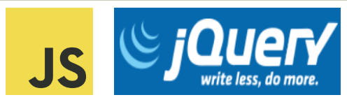
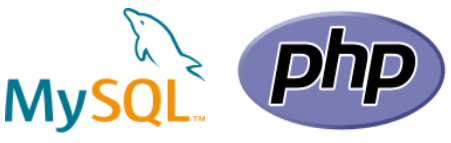

# The Full Stack Development docs

The workspace will use front-end and back-end tools to develop web apps.

# Week 1

<div align="center">
  
</div>
In week 1, we will use Git and Github to keep track of changes in the 
process of full stack development. I am attaching a book which is 
available on <a href="https://git-scm.com/">Git website </a>, to get to 
know everything about Git.

# Week 2

<div align="center">
  
</div>
In week 2, we will use HTML to create the webpage. CSS to style it. 
Bootstrap to create a responsive design for the web page. (Sources: 
[Css tricks](https://css-tricks.com), 
[Mozilla Developer](https://developer.mozilla.org/en-US/docs/Web/CSS), 
[W3Schools](https://www.w3schools.com/bootstrap5/index.php)

# Week 3

<div align="center">
  
</div>
In week 3, we will use JavaScript to validate form on client-side. Jquery 
to develop applcations based on ajax. 
[W3Schools](https://www.w3schools.com/jquery/default.asp), 
[Mozilla Developer](https://developer.mozilla.org/en-US/docs/Web/JavaScript) 

# Week 4

<div align="center">
  
</div>
In week 4, we will use PHP to validate form on server-side. With PHP and 
MySQL we will design a database. This will allow us to insert, update, 
delete and search for values in the database. 


To run php and mysql server, we need a locally hosted server. We will use
[Xampp server](https://www.apachefriends.org/download.html)
to create our database. After installing it, "start" the Apache Module and 
MySQL Module in Xampp Control Panel. It will start the services needed 
to run a server on local host.


Place the php files in C:/xampp/htdocs folder (Windows) to run php files.

To access database type the URL: http://localhost/phpmyadmin/

To access files type the URL: localhost


[MySQL website](https://dev.mysql.com/doc/refman/8.0/en/tutorial.html),
[W3Schools](https://www.w3schools.com/php/)

# Week 5

<div align="center">
  
</div>
In week 5, we will use React Js to create a webpage for realtime calculations.


To run react server we will use some commands to initialize a react application.

```
npx create-react-app week5
cd week5
npm start 
```

App connects to localhost at URL: http://localhost:3000
[React learn]https://react.dev/learn)
